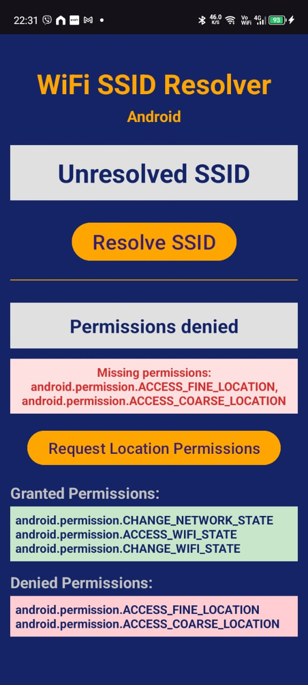
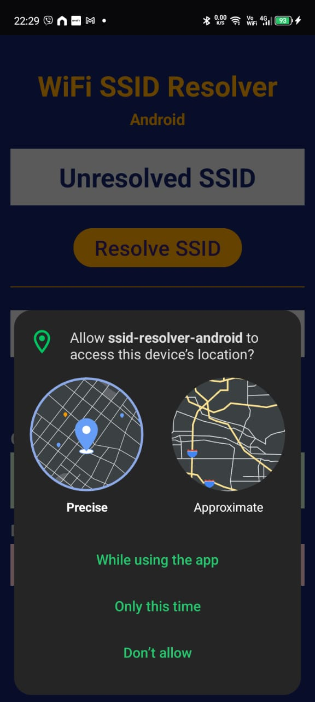
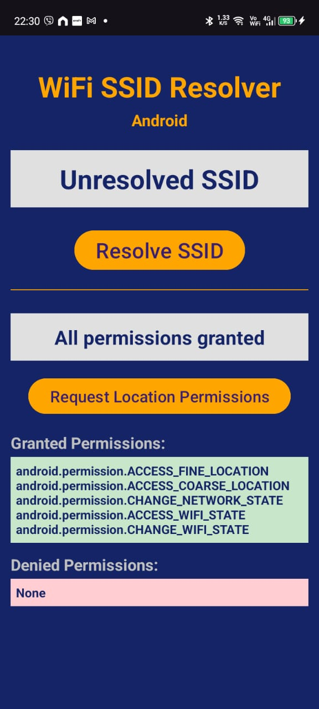
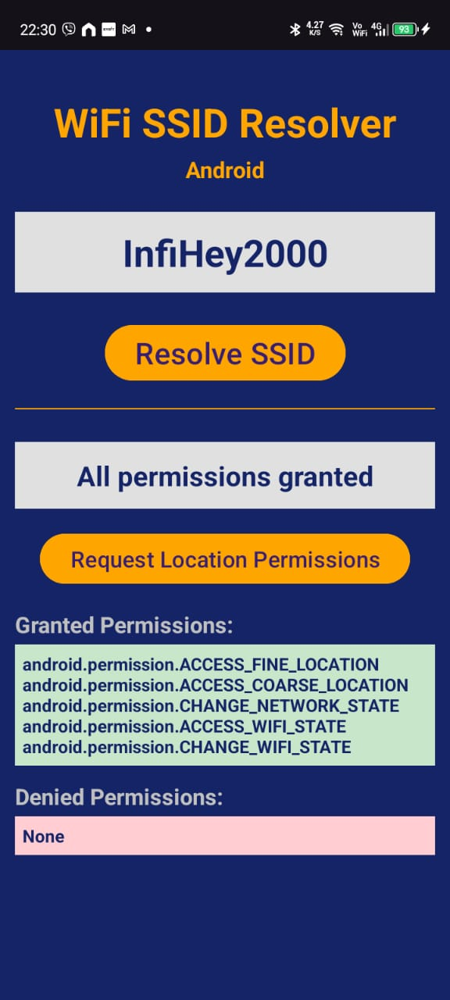

# ssid-resolver-android - "Get my Wifi Name"

A standalone app to resolve the SSID of the connected WiFi network in Android, or simply: "Get my Wifi Name". This implementation uses the
latest Android APIs as of January 2025.

This code was created to be wrapped as a Flutter plugin, which you can find here: https://github.com/raoulsson/ssid_resolver_flutter_plugin

## Quick Info

A short implementation that resolves the SSID of the connected WiFi network in Android.
After failing to get the library network_info_plus to do this, I decided to write my own plugin.
This plugin is not production ready and should be used with caution.

|                                                                                                                                         |                                                                                                                                               |
|-----------------------------------------------------------------------------------------------------------------------------------------|-----------------------------------------------------------------------------------------------------------------------------------------------|
| <br />Not all permissions granted | <br />OS dialog to grant permissions |
| <br /> All permissions granted        |  <br /> Network SSID resolved                 |


Further relevant methods might be added soon.

## Needed Permissions

This app uses the latest Android APIs as of 2025 and needs the following permissions, defined in the `AndroidManifest.xml` file:

```xml
    <uses-permission android:name="android.permission.ACCESS_FINE_LOCATION" />
    <uses-permission android:name="android.permission.ACCESS_COARSE_LOCATION" />
    <uses-permission android:name="android.permission.CHANGE_NETWORK_STATE" />
    <uses-permission android:name="android.permission.ACCESS_WIFI_STATE" />
    <uses-permission android:name="android.permission.CHANGE_WIFI_STATE" />
```


# License

Copyright 2025 Raoul Marc Schmidiger (hello@raoulsson.com)

Permission is hereby granted, free of charge, to any person obtaining a copy of this software and associated documentation files (the “Software”), to deal in the Software without restriction, including without limitation the rights to use, copy, modify, merge, publish, distribute, sublicense, and/or sell copies of the Software, and to permit persons to whom the Software is furnished to do so, subject to the following conditions:

The above copyright notice and this permission notice shall be included in all copies or substantial portions of the Software.

THE SOFTWARE IS PROVIDED “AS IS”, WITHOUT WARRANTY OF ANY KIND, EXPRESS OR IMPLIED, INCLUDING BUT NOT LIMITED TO THE WARRANTIES OF MERCHANTABILITY, FITNESS FOR A PARTICULAR PURPOSE AND NONINFRINGEMENT. IN NO EVENT SHALL THE AUTHORS OR COPYRIGHT HOLDERS BE LIABLE FOR ANY CLAIM, DAMAGES OR OTHER LIABILITY, WHETHER IN AN ACTION OF CONTRACT, TORT OR OTHERWISE, ARISING FROM, OUT OF OR IN CONNECTION WITH THE SOFTWARE OR THE USE OR OTHER DEALINGS IN THE SOFTWARE.
