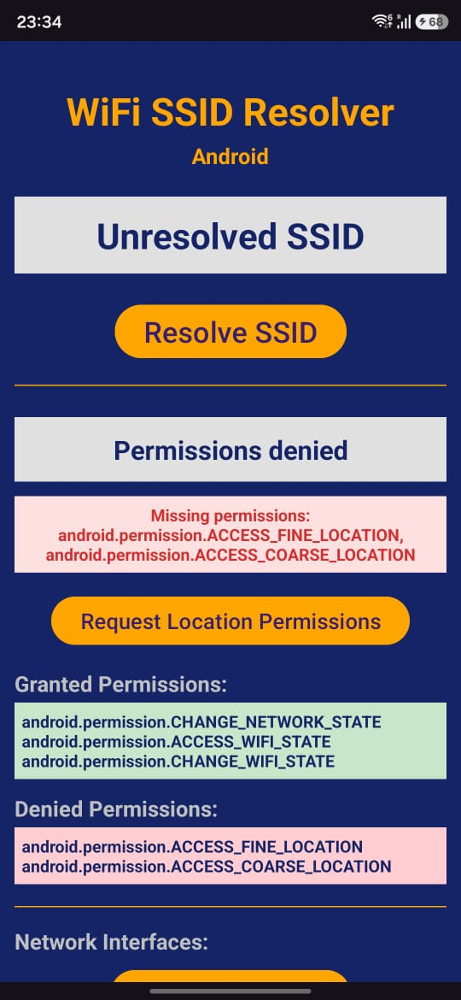
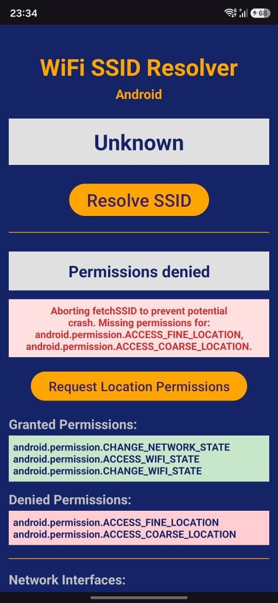
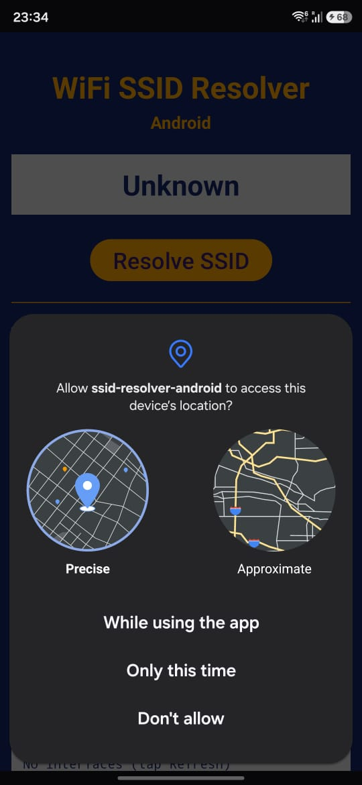
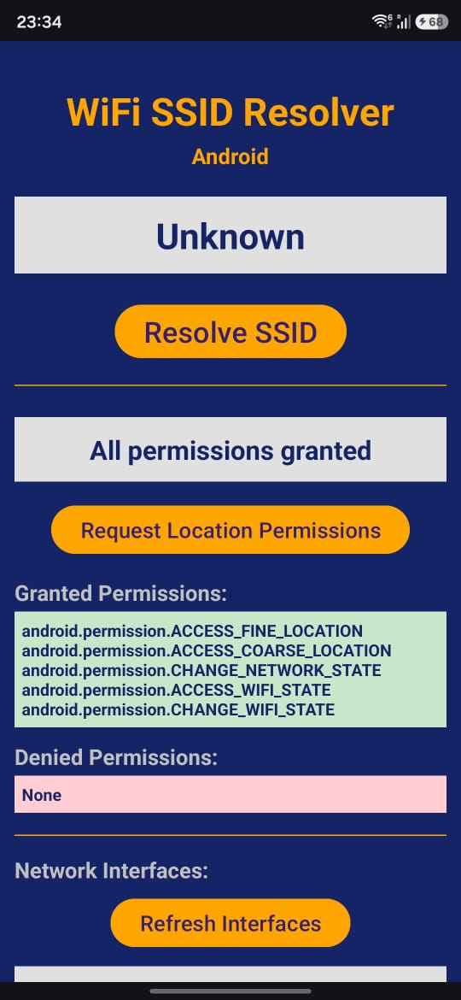
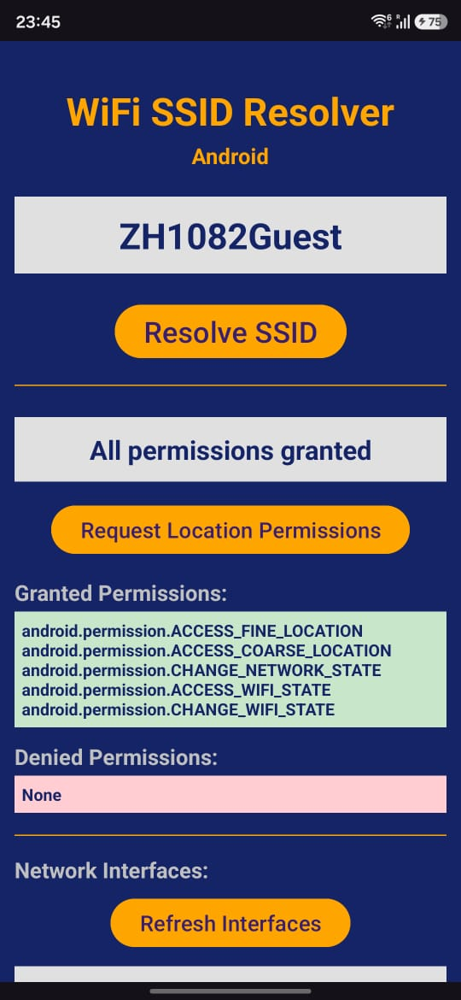
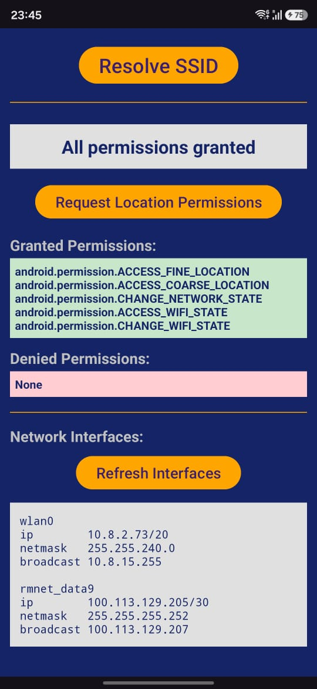

# ssid-resolver-android - "Get my Wifi Name"

A standalone app to resolve the SSID of the connected WiFi network in Android, or simply: "Get my Wifi Name". This implementation uses the
latest Android APIs as of January 2026.

This code was created to be wrapped as a Flutter plugin, which you can find here: https://github.com/raoulsson/ssid_resolver_flutter

> [!IMPORTANT]
> **Version 2.0 - it can now read the netmask, which Android gives you and most code throws away.**
>
> `NetworkInterfaceResolver` lists every IPv4 interface with its **real netmask** and the broadcast
> address derived from it, via `java.net.NetworkInterface`.
>
> It needs **no runtime permission** - not Location, not `ACCESS_WIFI_STATE` - so the list works on a
> device where the user denied everything and no SSID can be resolved.
>
> Two implementations, because one is not enough. `java.net.NetworkInterface` is tried first, but on
> Android 11+ the `/proc/net` restrictions can make `getNetworkInterfaces()` return **null** - observed
> on a Samsung running Android 15, where it returns null rather than throwing, and
> `Collections.list(null)` then dies with an NPE. `ConnectivityManager`/`LinkProperties` is the
> fallback and gives the prefix length directly. It needs `ACCESS_NETWORK_STATE`, declared in the
> manifest: a normal permission, granted at install with no prompt.
>
> This matters because without a netmask there is no way to compute a broadcast address, and the usual
> workaround - take the first three octets and append `.255` - is only correct on a `/24`. On a `/20`,
> a host at `10.8.2.76` has its broadcast at `10.8.15.255`, while the shortcut yields `10.8.2.255`: an
> ordinary unused host address that silently swallows everything sent to it, with no error to go on.
>
> Cellular is worth a look too. It typically carries a `/32`, where the derived broadcast equals the
> interface's own address - so any code picking broadcast targets has to exclude it rather than treat
> it as one more network.


## Quick Info

A short implementation that resolves the SSID of the connected WiFi network in Android.
After failing to get the library network_info_plus to do this, I decided to write my own plugin.
This plugin is not production ready and should be used with caution.

### What it looks like

The full permission path on a physical Samsung, left to right, top to bottom.

|                                                                                                                        |                                                                                                                                    |
|------------------------------------------------------------------------------------------------------------------------|--------------------------------------------------------------------------------------------------------------------------------------|
| <br />**1.** Location denied, so the SSID cannot be resolved | <br />**2.** It names the exact permissions that are missing |
| <br />**3.** The runtime prompt for fine and coarse location | <br />**4.** All permissions granted, ready to resolve |
| <br />**5.** Resolved: `ZH1082Guest` | <br />**6.** Interfaces with real netmasks - no runtime permission needed |

Screenshot 6 is the interesting one. `wlan0` sits on a `/20`, so its broadcast is `10.8.15.255` - not
the `10.8.2.255` that a "first three octets plus `.255`" shortcut would produce. `rmnet_data9` is
cellular on a `/30`.

Further relevant methods might be added soon.

## Needed Permissions

This app uses the latest Android APIs as of 2025 and needs the following permissions, defined in the `AndroidManifest.xml` file:

```xml
    <uses-permission android:name="android.permission.ACCESS_FINE_LOCATION" />
    <uses-permission android:name="android.permission.ACCESS_COARSE_LOCATION" />
    <uses-permission android:name="android.permission.CHANGE_NETWORK_STATE" />
    <uses-permission android:name="android.permission.ACCESS_WIFI_STATE" />
    <uses-permission android:name="android.permission.CHANGE_WIFI_STATE" />
```


# License

Copyright 2025 Raoul Marc Schmidiger (hello@raoulsson.com)

Permission is hereby granted, free of charge, to any person obtaining a copy of this software and associated documentation files (the “Software”), to deal in the Software without restriction, including without limitation the rights to use, copy, modify, merge, publish, distribute, sublicense, and/or sell copies of the Software, and to permit persons to whom the Software is furnished to do so, subject to the following conditions:

The above copyright notice and this permission notice shall be included in all copies or substantial portions of the Software.

THE SOFTWARE IS PROVIDED “AS IS”, WITHOUT WARRANTY OF ANY KIND, EXPRESS OR IMPLIED, INCLUDING BUT NOT LIMITED TO THE WARRANTIES OF MERCHANTABILITY, FITNESS FOR A PARTICULAR PURPOSE AND NONINFRINGEMENT. IN NO EVENT SHALL THE AUTHORS OR COPYRIGHT HOLDERS BE LIABLE FOR ANY CLAIM, DAMAGES OR OTHER LIABILITY, WHETHER IN AN ACTION OF CONTRACT, TORT OR OTHERWISE, ARISING FROM, OUT OF OR IN CONNECTION WITH THE SOFTWARE OR THE USE OR OTHER DEALINGS IN THE SOFTWARE.
